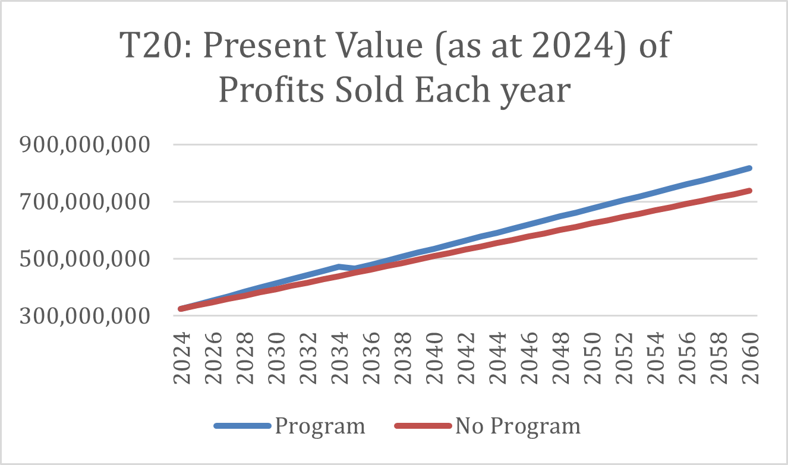
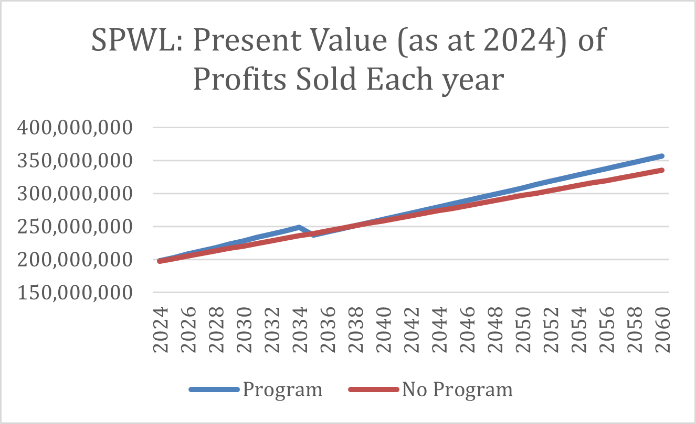
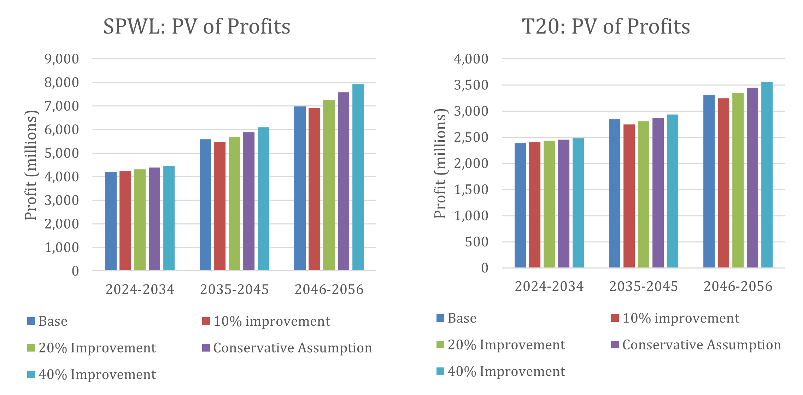

# 2024 SOA Challenge 
# Rare5 Consulting: SuperLife’s Health Incentive Program Proposal

#### Source: https://www.everydayhealth.com/about-us/ 
---

### Members: Daniel Bounitch, Gordon Law, Minh Chau Diep, Shagota Khan and Yasmin Haideri
---

## Table of Contents
- [Objectives](#objectives)
- [Program Design](#program-design)
- [Performance Metrics](#performance-metrics)
- [Assumptions](#assumptions)
- [Data Limitations](#conclusion)
- [Pricing and Costs](#pricing-and-costs)
- [Ethical Considerations](#ethical-considerations)
- [Sensitivity Analysis](#sensitivity-analysis)
- [Risk and Risk Mitigation Considerations](risk-and-risk-mitigation-considerations)
- [Conclusion](#conclusion)
- [References](#references)

---

## Objectives
SuperLife is one of the main life insurance carriers in the country of Lumaria. In the last 23 years, SuperLife has sold two life insurance products: single-premium whole life insurance (SPWL) and 20-year term life insurance (T20). The company is looking to build a health incentive program that aims to achieve its objectives of:

- Incentivising healthy behaviours through active participation in the program,
- Decreasing expected mortality,
- Increasing life insurance sales,
- Improving product marketability and competitiveness and,
- Adding economic value to the company.
  
In this report, we have proposed a health incentive program that consists of three main phases: Gamifying Health, a Smoking Cessation Program and Holistic Prevention and Educational Programs. Through the implementation of the programs, we are confident that SuperLife will achieve all five objectives.

## Program Design 
As mentioned previously, the program will consist of three pillars: *Gamifying Health*, *Smoking Cessation Program* and *Holistic Prevention and Educational Programs*.

### Gamifying Health

Source: https://support.apple.com/en-mt/108359

The first part of our proposed health incentive program is to Gamify Health. This consists of creating a points-based incentives program that allows individuals to receive cash at the end of the calendar year if they achieve enough points. The points will be gained if individuals participate in healthy behaviours every day including sleeping seven hours, being outside during daylight hours for over 180 minutes, or achieving 10,000 steps. To ensure individuals are actively participating in healthy behaviours, the number of points rewarded for each activity will depend on the time commitment. For example, the points associated with spending 3 hours outside during the day will be higher than the points for achieving 10,000 steps. As a way of encouraging the development of positive habits, bonus points will be awarded to policyholders who continue to achieve over 90% of their daily goals for an extended duration (up to 50 years after the first goal was achieved). A breakdown of how points will be rewarded can be found in Appendix A.1. The goals that individuals are required to reach are also designed to ensure trackability; the harder it is to track, the less points associated to the goal.

A new customer-centric app will provide a colourful and captivating overview of their own health. Front and centre on the dashboard we will display three rings for the three daily goals so that policyholders can track their progress towards living a healthier life each day in real time (outer ring - sun, middle ring - walk, inner ring - sleep). Moreover, as part of the app the user can opt-in to receiving notifications in the form of gentle reminders when they are getting close to meeting their goals or positive messages of encouragement when there is a significant deterioration. Leveraging sophisticated machine learning algorithms, users will be able to view data trends in the palm of their hands and discover new strategies on how to keep improving. We believe the app will assist customers to become more active whilst improving their sleep quality.

The program will be available to all participants. Research finds by gamifying health, it incentivises individuals to participate in easy healthy behaviours that can significantly improve their wellbeing (Mitesh, et al., 2019). The approach is also marketable and makes the life insurance products sold by SuperLife more attractive compared to other insurance programs. By rewarding healthy behaviours, policyholders would not only be more engaged with their life insurance policy, but also find value in the short-term rewards making them less likely to lapse on their policy. This will improve SuperLife’s ability to retain its customers whilst also improving mortality.

### Smoking Cessation Program
The smoking cessation program will be centred around helping smokers to stop smoking permanently. Through analysing SuperLife’s policyholder experience, we have found that whilst only 6.3% of SuperLife’s customers are smokers, 35.4% of all deaths recorded were due to smoking. Besides being a main contributor to population mortality, smoking also has follow-on effects, and can contribute to other diseases that would also eventually increase mortality (Qin, 2020). Circulatory System Diseases are more prevalent among smokers (Gallucci, et al., 2020) and is also the second highest cause of death of SuperLife’s policyholders. Therefore, by implementing a smoking cessation program, the expected mortality for smokers is likely to greatly decrease.

It has been proven that subsidising smoking cessation treatment increases the chances of successful long-term abstinence, and that full-coverage intervention do not offer any significant benefits for quitting rates compared to partial-coverage (van den Brand, et al., 2017). Therefore, SuperLife will partially subsidise its policyholder’s treatments. The program outline as well coverage cost detail is explained in Appendix A.2. Individuals that require additional support outside the program will need to pay out-of-pocket, however, the cessation program will ensure individuals are provided guidance on how to find additional resources.

### Holistic Prevention and Educational Programs
The last aspect of the health program we propose is focusing on holistic prevention. One of the most effective ways to treat most diseases and ensure longevity of an individual's health, ceteris paribus, is concentrating on preventative measures.

Within the provided in-force dataset, the top five causes of death were:
- Neoplasms (Tumours/Cancer): 33% of all deaths
- Circulatory System Diseases: 30% of all deaths
- External Reasons (e.g. public accidents, intentional self-harm): 8.8% of all deaths
- Respiratory System Diseases: 6.7% of all deaths
- Digestive System Diseases: 4.6% of all deaths

Therefore, to help reduce mortality of existing policyholders, we have considered four main programs which directly aim to target the top 5 causes of deaths. These are:

- *Cancer Prevention Initiative*. As shown above, neoplasms (i.e. cancer/tumours) were the highest cause of death amongst policyholders. By educating individuals on this topic, we aim to reduce the number of deaths relating to cancer.
- *Educational Workshops*. Learning how to live a healthy lifestyle is a common preventative measure that many health professionals recommend, noting it helps reduce the chance of developing diseases in the future. This may include encouraging healthy eating habits and doing exercise.
- *Safety Campaigns*: This campaign aims to target the third highest cause of death for policyholders, which was noted to be accidents.
- *Annual Health Check-ups*: This campaign intends to allow policyholders to discover any new diseases in the early stages, such that treatment can be arranged before it is too late.

The program will involve campaigns in the form of workshops, reminder emails and community outreach. In the case of workshops, these will be advertised first to policyholders but is also open to the public. If non-policyholders are interested, they will need to provide their contact details. Therefore, the program will not only reduce the expected mortality of policyholders but will also have reputational benefits allowing SuperLife to gain exposure and attract new customers.

## Performance Metrics 
In addition to creating a health incentive program, we also emphasise the importance of monitoring the program to ensure that it is achieving the desired response. The short-term and long-term metrics that should be monitored are outlined below.

### Short Term (0-10 years)
- Compare actual vs expected mortality improvements due to the program every 5 years. This will signal if assumptions need to be updated due to the mortality improvement experience being more optimistic or pessimistic than anticipated.
- Monitor engagement rates of each incentive program separately. Engagement rates can showcase which incentive programs are attracting more customers and are more efficient.
- Periodically review the percentage of new policies written and ensure it is in line with expectations. Lower rates may indicate potential deficiencies within the program.
- Monitor lapse rates to ensure that they are not significantly increasing due to the implementation of the program.
- Engage with customers for feedback (through surveys) on all three programs to help shape further improvements. This can help improve the program to better suit policyholders' needs.

### Long Term (10-20 years)
- All the short-term metrics should also be used for long term. However, due to having experience data with a longer time horizon, findings should be more robust.
- Comparing actual vs expected mortality improvements due to the program every 10 years will provide a more wholistic picture. After 11 years, it is expected that the mortality improvements of the programs are fully realised. This analysis will assist in showcasing how effective the program is by checking whether savings have aligned with our forecasts.
- Compare expected profit gained with actual profit gained. Review all assumptions in pricing.

## Assumptions 
The pricing of the insurance policies for both SPWL and T20 are dependent on several assumptions. These are summarised below. For a more detailed analysis of each assumption, please refer to Appendix B.
- A lapse rate of 2% for T20 policies was set. This was based on historical information using the most recent 10 years. It was found that lapse rates were relatively consistent around 2% for all years, and all policy durations (Appendix B.1).
- Based on Lumaria Historical Inflation and Interest rates between 1962 and 2023, an investment rate of 8% and discount rate of 11% was calculated (Appendix B.2).
- Cost of incentives per policyholder was dependent on the ‘Interventions Data’ provided by SuperLife’s product team. The midpoint of the range was chosen to be the best estimate for costs and mortality improvement. Whilst we expect that costs will decrease as the program matures; we have assumed inflation will counteract the decrease.
  
  |Intervention Name | Costs | Mortality Improvement|
  |------------------|-------|----------------------|
  |Gamifying Health - Financial Incentives| 52.5 Č| 3.5% |
  |Smoking Cessation Programs*|32.08 Č|25%|
  |Safety Campaigns| 22.5 Č| 4%|
  |Cancer Prevention Initiatives Educational Workshops|52.5 Č|7.5%|
  |Annual Health Check-ups**|0 Č| 7.5%|

  *See Appendix A.2

  **See Appendix B.3
  
- Mortality improvement rates for each program (as shown above) were also dependent on the ‘Interventions Data’ provided by SuperLife’s product team.
  - We have also assumed that mortality improvements uniformly impact all ages, except policyholders over 80, who experience no mortality improvement, as mortality improvements are unlikely to occur at older ages.
  - As there are numerous incentives in place, there is likely to be an interaction effect, which reduces the improvement in mortality as certain interventions may overlap. This is done by applying a penalty to mortality improvement based on the number of interventions, which is six for smokers and five for nonsmokers (Appendix B.4).
  - Mortality improvements were also assumed to be gradual across the first 10 years after the program is implemented. Mortality improvements are only fully realised in the 11th year (Appendix B.5).
- Mortality rates were analysed separately for different ages, sex, smoking and underwriting risk as each had a noticeable impact. To model the impact, a logistic regression was fitted (Appendix B.6) and used to create 12 subsets of policyholders. There are 12 subsets, as there are no smokers that have very low, or low underwriting risk. A manual adjustment was made to the mortality table, whereby the maximum age was set to be 90, reflecting the data from existing policyholders where there are very few survivors past age 80. Mortality for ages 81 to 89 were thus linearly interpolated from 80 to 90 to reflect high probability of death for the elderly.
- It was assumed that with no program put into place, the annual increase in new policy count would increase in a linear trend in line with historical data subject to a 10% penalty to be conservative. With implementation of the program, due to the attractiveness of the program and improved marketing efforts, it is assumed that the annual increase in new policy count would be 30% more than if no program was to be implemented.
- Profit Margin was assumed to 10% for each policy (for both T20 and SPWL)

## Data and Data Limitations 
1. Mortality Improvements: Due to limited availability of data, the impact of each program on mortality rates is heavily reliant on SuperLife’s product development team’s data.
2. Program Costs: Due to the limited data available on program incentive costs, we also rely heavily on the Interventions data provided by SuperLife’s product development team.
3. Smoking Cessation Costs: We have used external research to estimate smoking cessation costs, however, it should be noted that this was based on the US demographic as of 2008. Existing US smoking cessation programs have contributed to a fatter right tail in their age distribution relative to Lumaria. Costs were inflated to 2023 US dollars and then converted to Crowns using the given exchange rate (Lumarian Č 1.743 = US $1) to produce an estimate.
4. Mortality Table: The logistic regression that was used to model mortality used the in-force dataset provided by SuperLife, which does not have a very long history of selling life insurance (started in 2001). As term life insurance has a maximum issue age of 55 and whole life insurance has a maximum age of 65, the oldest cohort of survivors is only currently 87, which severely impacts the ability to model mortality of older policyholders.
5. Mortality Improvement Per Age: The given interventions were utilised and were assumed to have the same impact on mortality for policyholders younger than 80. This is a very strong assumption and is thus a key limitation to the results as it is unknown if certain interventions may improve mortality in males more than females or improve mortality in those aged 50 and younger more than improving mortality in those aged 50-80.
6. Other Causes of Improvement: Our mortality tables do not account for the fact that mortality tends to improve yearly (Crimmins, 2015), and even without the program. Therefore, our mortality tables are conservative in this regard.

## Pricing and Costs 
### Mortality Savings
The mortality savings were calculated to assess the impact of mortality improvements on pay- outs. To obtain this, we found the total sum of claims per segment per year for the last 20 years. The improved mortality rate if the program was in effect for each segment was then divided by the base mortality with no program to identify the ratio of improved to base mortality. Finally, the improved mortality ratio was multiplied by the total pay-out without the program to obtain the new total pay-out and the percentage saving because of the program. From the below graph, by implementing the program, we can expect mortality savings ranging from 10% to 24%.

|Segment    (Sex/Smoker Status/Underwriting Class)|Total Pay-out without Program ($m)|Improved Mortality Ratio|Total Pay-out with Program ($m)|% Saving|
|---------------------------------------------|----------------------------------|------------------------|----------------------------------|---------|
|Male/Smoker/High|1,822.05|76.64%|1,396.37|23.36%|
|Male/Smoker/Moderate|5,045.60|76.86%|3,877.80|23.14%|
|Male/Non-Smoker/High|1,522.05|89.60%|1,363.70|10.40%| 
|Male/Non-Smoker/Moderate|2,617.50|89.50%|2,342.54|10.50%| 
|Male/Non-Smoker/Low|3,496.45|89.50%|3,129.16|10.50%| 
|Male/Non-Smoker/Very Low|3,873.30|89.59%|3,470.22|10.41%| 
|Female/Smoker/High|605.75|76.48%|463.29|23.52%| 
|Female/Smoker/Moderate|1,690.65|76.43%|1,292.14|23.57%| 
|Female/Non-Smoker/High|676.30|89.56%|605.71|10.44%| 
|Female/Non-Smoker/Moderate|1,297.65|89.60%|1,162.64|10.40%|
|Female/Non-Smoker/Low|1,620.55|89.56%|1,451.34|10.44%| 
|Female/Non-Smoker/Very Low|1,961.10|89.47%|1,754.63|10.53%|

### Economic Value
To assess the economic value of the program, the profit was used. It was calculated by first finding profit per policy per year and then multiplying it by the best estimate of policy count. A step-by-step methodology on how annual premium and profit was calculated for T20 and SPWL policies can be found in Appendix C.2.

#### *20-Year Term Life*
Due to the improved mortality, the premiums charged per individual have improved across all segments (Appendix C.3), even with the increase of expenses charged to the policyholder with the program. The improvement is very minimal for the first 10 years, whilst the decrease is more noticeable when mortality improvements are realised. Due to decrease in premium collected, the profit per policyholder expectingly will decrease. However, this is offset by an increase in policyholder count.
As shown in the figure to the right, the first 10 years showcases an increase in profit. This is due to an increase in expenses with very minimal mortality benefit. However, after the full benefit for mortality is realised, and the number of policyholders expected to join SuperLife increases, the overall PV of profit earned per year exceeds that of the status quo.

#### *Single Premium Whole Life Insurance*
A similar trend was found for SPWL, as shown on the right. The premiums were lower across all consumer segments since mortality savings were greater than the expenses paid (Appendix C.3). However, due to SPWL insurance being, on average, more profitable compared to term life insurance, the magnitude of the profit earned is far greater.

## Premium Changes
The premiums above assume a 10% profit margin. Due to limited data, we were not able to carry out extensive research into competitor pricing. If competitor pricing is cheaper, SuperLife should consider reducing their profit margins to become more competitive. Cost-reduction efforts can involve negotiation with vendors (i.e., partnered medical care providers can provide lower-cost service) and creating more targeted incentives (i.e., health incentives will prioritise more at-risk groups with poorer lifestyle, as opposed to already healthy groups with adequate lifestyle, to ensure the highest mortality reductions).

Due to profit margins being embedded in the premium price, the trend of economic value should not change, but rather the magnitude. As we will pass on the mortality savings to our customers in the form of reduced premiums (keeping the profit margin fixed at 10%), the average profit per customer will decline. However, the decrease in profit per customer should be more than offset by a significant increase in the total number of policyholders due to more competitive pricing.

At the same time, SuperLife should also ensure that premiums are not significantly below competitors. This could lead to adverse selection, whereby we are writing risky business for less premium, and could lead to a decline in profitability. Moreover, continuously lowering premiums without a commensurate reduction in mortality will be unsustainable in the long-term, so SuperLife needs to ensure its finances are strong enough to fulfil financial obligations and maintain the quality of its health benefits. That way, the company can ensure it will be financially stable even when mortality improvements deviate from the program assumptions.

## Ethical Considerations
There are some ethical considerations with the recommendations we provided. The “cross- subsidisation” for the smoking program may create inequity, as non-smokers might resent subsidising for smoking cessation treatment. This can be seen as coercive and discriminatory towards people who choose to not participate. However, the program’s high cost might be an obstacle for smokers who genuinely want to quit. Therefore, we decided during the design stage that the whole cohort will help subsidise the cost, making it more affordable when shared amongst many.

The program might disadvantage people from lower SES (Socioeconomic Status) backgrounds, as they might struggle to afford fresh produce or gym memberships. Moreover, as people in lower SES backgrounds tend to work long hours, they might not have enough spare time to fully participate.

This can also especially impact vulnerable policyholders who are unable to participate in some programs, such as the disabled who may not have the accessibility to attend educational workshops and have trouble achieving 10,000 steps per day. This may be mitigated by adjusting the financial incentives for disabled individuals (e.g. more points for being outdoors) as well as promoting online workshops for policyholders that have difficulty attending in-person programs.

To ensure SuperLife is acting in the best interest of its policyholders, we recommend continuous surveys to be collected to identify any other ethical concerns and to check whether the program is accessible for as many people as economically possible. This ensures SuperLife is not only profitable but provides a service that embodies ethics and fairness, bolstering its reputation.

## Sensitivity Analysis
Through carrying out various sensitivity analysis, we found the greatest impact on profit is the number of policyholders that the new program will attract.

 

Similar trends are found for T20 and SPWL products, where the increase in policyholders has the greatest impact on profit after 10 years. Whilst majority of the stresses overtake the base case (which assumes no program), a 10% improvement in policyholder rates does not ever generate more profit than the base case. If SuperLife finds itself in a situation whereby profits are not exceeding the base case due to policyholder participation, investigation into why this is the case should be undertaken. SuperLife should reassess its premiums, marketing, or attractiveness of each program. However, we are confident that the attractiveness and marketability of the program will fall between a 20-30% improvement in participation. This, as shown above, will reap favourable economic benefits.

## Risk and Risk MitigationConsiderations
1. **Cost Overruns (Financial)**: Actual costs may be higher than anticipated due to increased admin costs, reward pay-outs or unexpected changes in participant behaviour. SuperLife should monitor expenses closely and adjust as required to align with budget restraints. This involves having robust budgeting and financial forecasting processes.
2. **Investment Risk (Financial)**: Unexpected market downturns or return fluctuations could impact SuperLife’s ability to fund the health program. SuperLife should implement stress testing to understand how market fluctuations could impact investment returns and program funding. To minimise the impact of market volatility, investments should be diversified.
3. **Strategic Risk**: There is a lot of volatility surrounding the health incentive program’s performance. This includes impact on mortality improvements and yearly increase in policyholder count. As shown in our sensitivity analysis, these can greatly impact performance. SuperLife should monitor its key performance metrics to ensure assumptions are updated to respond to any shortfall from expectation.
4. **Market saturation**: Other insurance companies also offer similar or more competitive health incentive programs. As a result, the health incentive program does not attract the desired level of new policyholders. SuperLife should undertake competitive analysis to differentiate its program and tailor marketing strategies to target a specific market segment to attract and retain policyholders.
5. **Underwriting Risk**: There is a risk of mispricing the product due to inaccurately assessing a policyholder’s health status. If SuperLife does not ask the correct questions, and the premium prices are not reflective of the risks, it could lead to adverse selection. When investigating SuperLife’s experience, the distribution of deaths from High and Moderate risks were quite similar. This may indicate an underwriting issue. SuperLife should regularly review its underwriting modelling techniques to accurately reflect real world data. Continuously monitoring and reacting to feedback from the program is essential.
6. **Operational Risk**: The program might struggle to handle large numbers of participants. SuperLife should design the programs with scalability in mind by having separate but easily integrable modular components. (i.e., first component handling user registration, second for handling goal tracking, third for reward management)

## Conclusion
Rare5 Consulting advises SuperLife to adopt a three-pillar approach (Gamifying Health, Smoking Cessation Program and Holistic Prevention & Educational Programs) to incentivise healthy behaviours. This will reduce mortality rates, boost life insurance sales, and thus create economic value. Through the constant monitoring of performance metrics, we believe that the program will on average yield significant mortality savings. Despite several data limitations necessitating the development of assumptions, we remain confident that SuperLife will still benefit from mortality improvements and make strong progress towards its five objectives which collectively will improve the health & wellbeing of the Lumarian population.

## Appendix available in [Final Report PDF](Rare5_Consulting_Report.pdf)

## Links to relevant R codes and associated spreadsheets
- [EDA code](EDA.R)
- [Pricing and profit model code](Pricing-Codes_T20-and-SPWL.r)
- [Interest rate/inflation code](Assumptions.R)
- [Mortality Tables](https://github.com/Actuarial-Control-Cycle-T1-2024/group-page-showcase-rare5-consulting/blob/main/Mortality%20Tables%20and%20Mortality%20Improvement.xlsx)
- [Policyholder increase for Term life](https://github.com/Actuarial-Control-Cycle-T1-2024/group-page-showcase-rare5-consulting/blob/main/Economic%20Value/30%25/T20.xlsx)
- [Policyholder increase for Whole life](https://github.com/Actuarial-Control-Cycle-T1-2024/group-page-showcase-rare5-consulting/blob/main/Economic%20Value/30%25/SPWL.xlsx)
- [Economic Value](Economic_Value.xlsx)
- [Savings code](Savings.R)
- [Payout Tables](PayoutTables.xlsx)
- [Mortality Savings](Savings.xlsx)
- [Senstivity Analysis](https://github.com/Actuarial-Control-Cycle-T1-2024/group-page-showcase-rare5-consulting/tree/0caef455567b2c70365c4437555e4a9b6e9f1f73/Economic%20Value)

 

## References
1. Bhattacharyya, et al., (2008), Therapy for Cessation of Smoking, Med J Armed Forces India. Link: https://www.ncbi.nlm.nih.gov/pmc/articles/PMC4921594/
2. Crimmins (2015). Lifespan and Healthspan: Past, Present, and Promise. Gerontologist. Link: https://www.ncbi.nlm.nih.gov/pmc/articles/PMC4861644/
3. Gallucci, et al., (2020) Cardiovascular risk of smoking and benefits of smoking cessation. J Thorac Dis. Link: https://www.ncbi.nlm.nih.gov/pmc/articles/PMC7399440/
4. Joyce, et al (2008). The Effectiveness of Covering Smoking Cessation Services for Medicare Beneficiaries. Health Services Research, Link: https://sci-hub.se/10.1111/j.1475-6773.2008.00891.x
5. Mitesh, et al. (2019), Improving healthcare by gamifying it, Havard Business Review, Link: https://hbr.org/2019/05/improving-health-care-by-gamifying-it
6. Qin, et al. (2020) Light Cigarette Smoking Increases Risk of All-Cause and Cause- Specific Mortality: Findings from the NHIS Cohort Study. Int J Environ Res Public Health. 2020 Jul 15;17(14):5122. Link: https://www.ncbi.nlm.nih.gov/pmc/articles/PMC7399798/
7. van den Brand, et al. (2017). Healthcare financing systems for increasing the use of tobacco dependence treatment. The Cochrane database of systematic reviews, 9(9), CD004305. Link: https://pubmed.ncbi.nlm.nih.gov/28898403/
8. Wilkes S. (2008) The use of bupropion SR in cigarette smoking cessation. Int J Chron Obstruct Pulmon Dis.;3(1):45-53. Link: https://www.ncbi.nlm.nih.gov/pmc/articles/PMC2528204/#:~:text=Bupropion%20is%20 effective%20in%20the,reuptake%20within%20the%20synaptic%20cleft.
